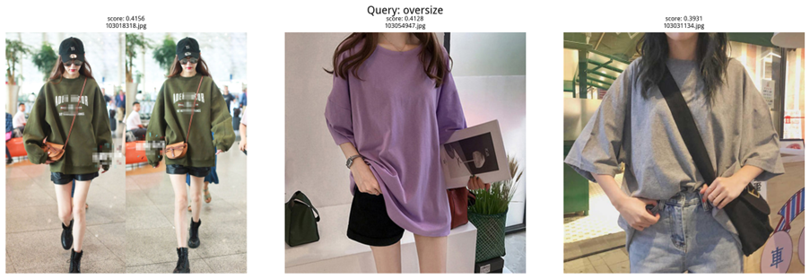
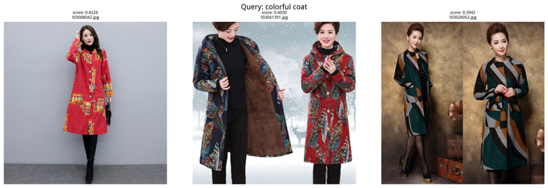
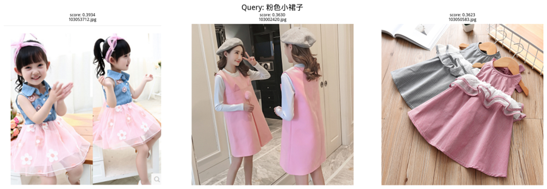
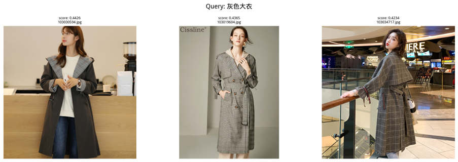

### 一、Qwen3-VL-Embedding 模型

https://modelscope.cn/models/Qwen/Qwen3-VL-Embedding-8B

### 二、Real-Scenario Multimodal Dataset from Taobao 数据集

https://tianchi.aliyun.com/dataset/87809

### 三、使用说明

1. 下载上述模型和数据集。数据集仅需multimodal_validpics.zip。
2. 将图像解压，放入Qwen3-VL-Embedding-8B/ 文件夹下images/。你可以使用check_images.py检查文件是否受损。
3. 运行embed_to_milvus.py，将图像进行向量化，得到milvus_qwen3vl.db。
4. 运行 server.py，使用 FastAPI 推理服务。
5. 新建窗口，运行 search.py。

### 四、配置说明

​	2 × NVIDIA RTX 4090

### 五、效果展示

